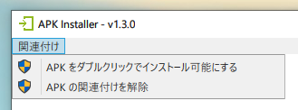

# APK Installer for Windows

これ以上なく簡単に APK をインストールできます。

- APK をドロップすると接続している全てのデバイスにインストールします。
- 複数まとめてドロップすることも出来ます。
- APK をダブルクリックしてインストールに対応させます。
- ADB を内包しているので、複雑な事前のインストール等も不要です。（端末メーカーの提供する USB ドライバは必要です）

## どうして作ったのか

`adb install -r path/to/apk` を叩くのが面倒になってしまって…

## ダウンロード

[ここをクリック](https://github.com/yutokun/APK-Installer/releases/latest/download/APKInstaller.exe)してダウンロードできます。

## できること

- ウインドウにドロップしてインストール
- exe ファイルにドロップしてインストール
- 複数 APK の一括インストール
- 接続している全てのデバイスへ一括インストール
- APK をダブルクリックしてインストール

## APK の関連付け

**関連付け**メニューから APK ファイルの関連付けを行うと、APK をダブルクリックしてインストールできるようになります。

## その他

エラーと対策を少し優しく教えてくれます。

## License

[Apache License 2.0](LICENSE)