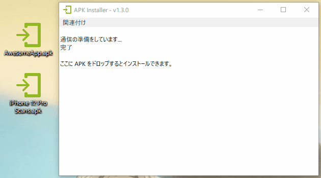
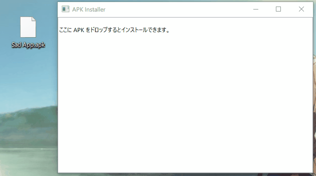

# APK Installer for Windows

ドロップすると接続しているデバイスに APK をインストールします。複数まとめてドロップすることも出来ます。ADB を内包しているので、事前のインストール等も不要です。

## どうして作ったのか

`adb install -r path/to/apk` を叩くのが面倒になってしまって…

## ダウンロード

[ここをクリック](https://github.com/yutokun/APK-Installer/releases/latest/download/APKInstaller.exe)してダウンロードできます。

## できること

- ウインドウにドロップしてインストール
- exe ファイルにドロップしてインストール
- 複数 APK の一括インストール
- 接続している全てのデバイスへ一括インストール

## まだできないこと・やりたいこと

- APK をダブルクリックしてインストール

## その他

エラーと対策を少し優しく教えてくれます。

## License

[Apache License 2.0](LICENSE)